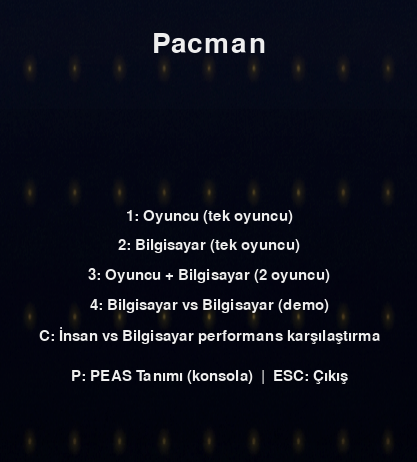
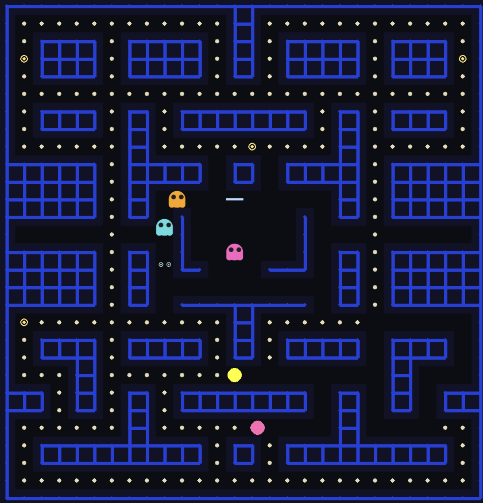
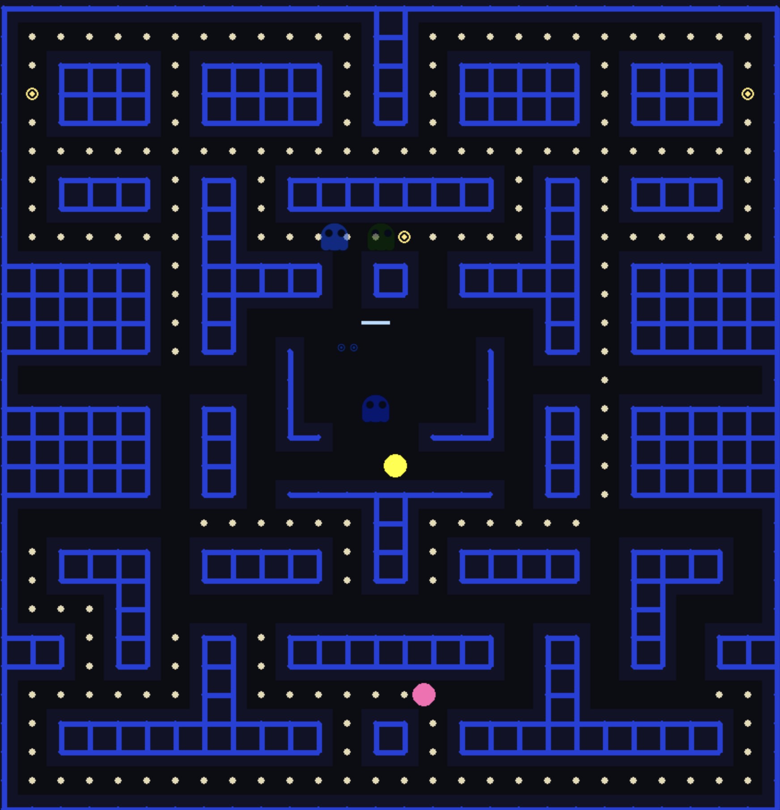

#  Pac-Man AI

Klasik Pac-Man oyununun insan ve yapay zeka destekli sürümü. Pygame ile geliştirilmiş, tek/çift oyuncu ve çeşitli AI modları sunar.



##  Özellikler

- **Tek oyuncu (insan)** — Klavye ile Pac-Man’i sen yönetirsin.
- **Tek oyuncu (bilgisayar)** — Pac-Man ve hayaletler AI tarafından oynanır.
- **İnsan vs Bilgisayar** — Sen Pac-Man, bilgisayar hayaletleri kontrol eder (2 oyunculu).
- **Bilgisayar vs Bilgisayar** — Tam otomatik demo.
- **Performans karşılaştırma** — İnsan vs AI skor ve süre karşılaştırması.
- **PEAS tanımı** — Konsola PEAS (Performance, Environment, Actuators, Sensors) çıktısı.
- Skor, süre ve can takibi; ses efektleri ve özelleştirilebilir hayalet görselleri.

##  Ekran Görüntüleri

  |  |

##  Kurulum ve Çalıştırma

### Gereksinimler

- Python 3.8+
- [Pygame](https://www.pygame.org/) 2.5+

### Kurulum

```bash
git clone https://github.com/KULLANICI_ADI/Pacman_Harun_Kaya.git
cd Pacman_Harun_Kaya
pip install -r requirements.txt
```

### Oyunu Başlatma

```bash
python main_oyun.py
```

##  Kontroller

| Tuş | Açıklama |
|-----|----------|
| **1** | Oyuncu (tek oyuncu) |
| **2** | Bilgisayar (tek oyuncu) |
| **3** | Oyuncu + Bilgisayar (2 oyuncu) |
| **4** | Bilgisayar vs Bilgisayar (demo) |
| **C** | İnsan vs Bilgisayar performans karşılaştırma |
| **P** | PEAS tanımını konsola yazdır |
| **ESC** | Çıkış |

**Oyuncu 1 (Pac-Man):** Ok tuşları (↑ ↓ ← →)  
**Oyuncu 2:** WASD

##  Yapay Zeka ve Teknik Mimari

### Utility-Based Agent Tasarımı

Bilgisayar kontrollü Pac-Man ve hayaletler **utility-based (fayda tabanlı) karar verme** ile yönetilir. Her adımda mümkün yönler için bir utility skoru hesaplanır; en yüksek utility’ye sahip aksiyon seçilir.

- **Pac-Man agent** (`src/agents/utility_agent.py` → `PacmanUtilityAgent`): En yakın pellet’e mesafe, power pellet’e mesafe, hayaletlere mesafe (normalde uzak, power modda yakın tercih), süre cezası ve skor projeksiyonu gibi özellikler ağırlıklı toplanır.
- **Hayalet agent** (`GhostUtilityAgent`): Chase modda Pac-Man’e yaklaşma, scatter modda köşelere yakınlık, korku (frightened) modunda Pac-Man’den kaçma; geri dönüş ve atalet cezaları ile dengelenir.

Her iki agent da yasal aksiyonları değerlendirip **en yüksek utility**’yi veren yönü seçer; belirsizlikte küçük rastgele jitter kullanılabilir.

### PEAS Çerçevesi

Ortam, **PEAS** (Performance, Environment, Actuators, Sensors) ile tanımlanır. Menüde **P** tuşu ile konsola PEAS çıktısı yazdırılır.

| Bileşen | Açıklama |
|--------|----------|
| **Performance** | Skoru maksimize et, tamamlanma süresini kısalt, tüm canları kaybetmekten kaçın. |
| **Environment** | Izgara labirent: duvarlar, yollar, pellet’ler, power pellet’ler, hayalet kafesi, oyuncu/hayalet konumları. |
| **Actuators** | Dört yönlü hareket (yukarı/aşağı/sol/sağ), power-up kullanımı, hayalet hareketi. |
| **Sensors** | Izgara konumları, duvar/yol bilgisi, pellet ve power pellet konumları, hayalet konumları, skor/can/süre. |

### Proje Yapısı (Teknik)

```
├── main_oyun.py         # Ana giriş (menü, mod seçimi, oyun döngüsü)
├── game_ayarlar.py      # Sabitler, harita, utility ağırlıkları (W_DOT, W_GHOST_SAFETY vb.)
├── entities.py          # GameMap, Player, Ghost; utility tabanlı karar (AI modları)
├── ui_sistemi.py        # Menü, tahta/HUD çizimi, performans karşılaştırma, PEAS metni
├── oyun_utils.py        # Ses, mesafe, harita yardımcıları
├── assets/
│   ├── images/        # Menü arka planı vb.
│   ├── ghost_images/  # Hayalet sprite’ları (isteğe bağlı)
│   └── sounds/        # Ses dosyaları (isteğe bağlı)
├── screenshots/
├── src/
│   ├── agents/        # utility_agent (PacmanUtilityAgent, GhostUtilityAgent), pacman_agent, ghost_agent
│   ├── state/         # Oyun ve varlık durumu
│   ├── entities/      # Pac-Man / Ghost entity sarmalayıcıları (agent ile)
│   ├── systems/       # Çarpışma, ses, giriş, çizim
│   └── levels/        # Harita yükleme ve layout'lar
└── requirements.txt
```


---


